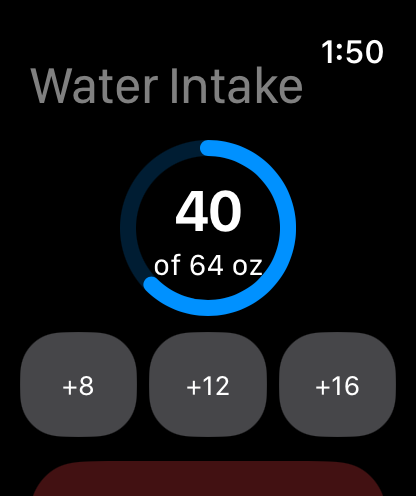
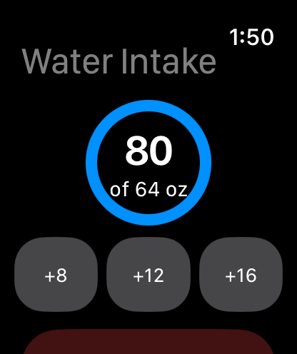
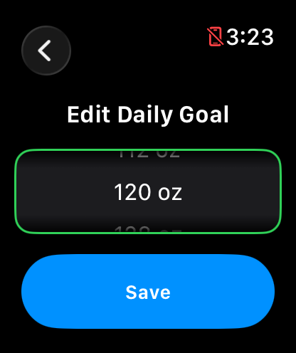
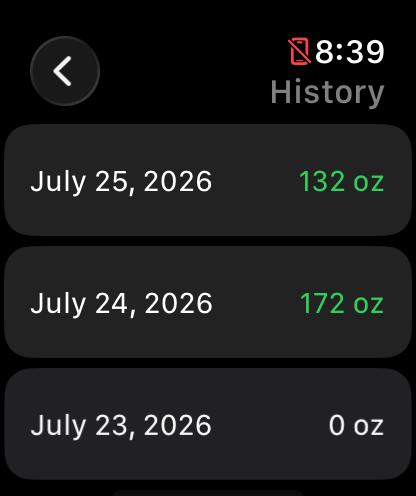
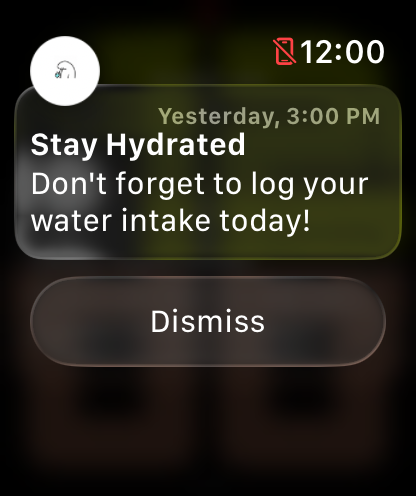

# Water Intake Tracker

A standalone watchOS app built in SwiftUI that helps users track daily water intake, set a personal hydration goal, and stay on top of it with a visual progress ring and daily reminder notifications.

## Features

- **Personalized daily goal** — a first-launch setup screen lets users set their own target intake (in ounces); this only appears once, and the goal can be edited anytime afterward
- **One-tap logging** — quick-log buttons (+8 oz, +12 oz, +16 oz) for fast entry directly from the watch
- **Visual progress ring** — fills in real time as the user logs water throughout the day
- **Undo support** — removes the most recently logged entry in case of a mistake
- **7-day history** — a simple list view showing daily totals, with goal-met days highlighted
- **Daily reminder notifications** — a local notification nudges the user if they haven't logged water
- **Fully offline** — all data is stored locally on-device; no network or account required

## Screenshots
### Goal Setup

### Editing Your Goal

### History

### Notifications

## Tech Stack

- **Swift** / **SwiftUI**
- **watchOS** (standalone Watch app, no iPhone companion required)
- **UserNotifications** framework for local reminders
- **UserDefaults + Codable** for local persistence (no backend)

## Architecture

The app follows a simple MVVM-style structure:

- `WaterEntry` — the data model for a single logged serving
- `WaterDataStore` — an `ObservableObject` that owns all app state: entries, daily goal, onboarding status, and persistence logic
- `GoalSetupView` — shown once, on first launch, to collect the user's daily goal
- `EditGoalView` — reachable anytime from the main screen to change the goal
- `ContentView` — the main screen (progress ring, quick-log buttons, undo, navigation)
- `HistoryView` — read-only 7-day history list
- `NotificationManager` — handles permission requests and scheduling the daily reminder

## Test Plan
See [WaterIntakeTracker_TestPlan.pdf](WaterIntakeTracker_TestPlan.pdf) for the full set of test cases covering onboarding, functional behavior, persistence, edge cases, and notifications.

## Setup

1. Clone this repo
2. Open `WaterIntakeTracker.xcodeproj` in Xcode
3. Select an Apple Watch simulator as the run destination
4. Build and run (`Cmd+R`)
